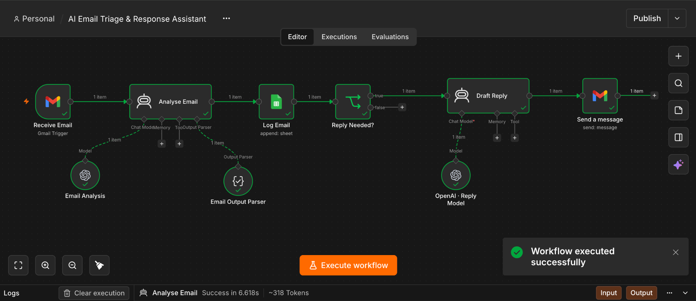

# AI Email Triage and Response Assistant

An n8n automation project that receives incoming Gmail messages, uses OpenAI to analyse and structure the email, logs the result in Google Sheets, decides whether a response is required, generates a reply, and sends it through Gmail.

## Overview

This project demonstrates a practical email support automation workflow built with n8n and OpenAI.



The goal is simple: reduce manual email triage while keeping the workflow easy to understand, test, and maintain.

The workflow processes each incoming email through a clear sequence of steps:

```text
Receive Email
    ↓
Analyse Email
    ↓
Log Email
    ↓
Reply Needed?
    ↓ Yes
Draft Reply
    ↓
Send a message
```

When a reply is not required, the workflow stops after the decision step.

## Workflow

### 1. Receive Email

A Gmail Trigger starts the workflow when a new email is received.

### 2. Analyse Email

An OpenAI powered agent reads the email and extracts structured information.

The analysis returns:

```text
Email
Subject
Issue
Category
Sentiment
Date
Reply Needed
```

Reply Needed uses a simple Yes or No value.

### 3. Email Output Parser

A Structured Output Parser keeps the AI response consistent so the next nodes receive predictable fields.

### 4. Log Email

The structured email information is appended to Google Sheets.

This creates a simple record of incoming messages and their classification.

### 5. Reply Needed?

An IF node checks the Reply Needed field.

If the value is Yes, the workflow continues to Draft Reply.

If the value is No, no automated response is generated.

### 6. Draft Reply

A second OpenAI model creates a response using the information from the analysed email.

The reply is written as clean plain text for email delivery.

### 7. Send a message

Gmail sends the generated response to the customer.

## What It Does

The workflow combines email intake, AI analysis, structured data extraction, logging, conditional routing, response generation, and Gmail delivery in one automation.

A typical example is a customer asking about a missing refund.

The workflow identifies the issue, classifies the message, records the result in Google Sheets, determines that a reply is required, generates a relevant response, and sends it through Gmail.

## Technology

| Tool | Purpose |
| --- | --- |
| n8n | Workflow automation and routing |
| OpenAI API | Email analysis and reply generation |
| Gmail | Email trigger and response delivery |
| Google Sheets | Structured email logging |
| Structured Output Parser | Consistent AI output |

## Key Design Choices

### Structured AI output

The first AI step does not return unrestricted text. The Structured Output Parser creates predictable fields that can be used by later workflow nodes.

### Separate analysis and response steps

Email analysis and reply generation are handled separately. This keeps each AI step focused on one task.

### Conditional routing

The workflow does not generate a response for every email. The Reply Needed field controls whether the reply path runs.

### Simple logging

Google Sheets provides a clear and accessible record of processed emails without adding unnecessary infrastructure to this portfolio project.

## Example Flow

```text
Incoming email:
Customer cannot attend a meeting and asks to reschedule.

Analysis:
Category: General
Sentiment: Neutral
Reply Needed: Yes

Action:
Log the email
Route through the Yes branch
Generate a reply
Send the response through Gmail
```

## Exported Workflow

[Download the real workflow](workflow/ai_email_triage_response.json).

This export preserves all nine original nodes, their versions, prompts, positions and connections. The final Gmail recipient mapping was corrected from the incoming To field to the incoming From field. The message body still uses the generated Draft Reply output.

Credential references and names, spreadsheet identifiers and URLs, the webhook identifier, workflow and version identifiers, and instance metadata were removed. Local node identifiers remain to preserve the workflow structure. The export is inactive and contains no pinned email data.

## Setup

Import `workflow/ai_email_triage_response.json` into a compatible n8n installation.

Assign Gmail credentials to Receive Email and Send a message, OpenAI credentials to both model nodes, and Google Sheets credentials to Log Email.

Replace `YOUR_GOOGLE_SPREADSHEET_ID` with your spreadsheet ID and select your worksheet. The example worksheet name is `Sheet1`. Create these column headers exactly: Email, Subject, Issue, Category, Sentiment, Date, Reply Needed.

The original model selections are preserved. Confirm that the selected model is available through your OpenAI API credentials, or choose an available model in both model nodes.

Keep the workflow inactive until you complete a controlled test. Confirm the trigger supplies From, Subject, snippet and internalDate, and inspect the final recipient preview before sending.


To reproduce this project, you need an n8n environment and credentials for Gmail, Google Sheets, and OpenAI.

Create the required credentials inside n8n.

Configure the Gmail Trigger to receive test emails.

Connect the OpenAI model to the Analyse Email node.

Configure the Structured Output Parser with the required fields.

Connect a Google Sheet to the Log Email node.

Set the Reply Needed IF condition to compare the Reply Needed value with Yes.

Connect the second OpenAI model to Draft Reply.

Configure the final Gmail node with the recipient, subject, and generated reply.

Run the workflow with a test email and confirm each node completes successfully.

## Testing

Earlier development included sample email executions. The published export has passed static JSON and connection checks, including preservation of all nine nodes and removal of the private identifiers in the source export. Its recipient mapping was corrected during publication.

The sanitized version has not been imported or executed against live accounts during this review. A successful live run is still required after configuring credentials, spreadsheet access and model availability.

Test a message that requires a reply and an acknowledgement that does not. Confirm the sheet receives the expected fields, the Yes branch reaches Draft Reply, the No branch stops, and the final Gmail recipient is the original sender. The reply body must be the generated output, not the incoming snippet.

## Security

Credentials and API keys are configured through n8n credentials and should never be committed to GitHub.

This repository does not publish personal credentials or API secrets.

See `SECURITY.md` for the repository security notes.

## Limitations

This is a portfolio automation project rather than a production customer support system.

The Reply Needed decision depends on the AI analysis.

Google Sheets is used as a simple logging layer.

The workflow does not include advanced approval logic, monitoring, or enterprise error handling.

Analysis uses the email snippet, so longer messages and attachments may not be fully represented. The Date field depends on internalDate being present and on model interpretation. Inspect its value during setup.

The example output schema defines strings but does not enforce the listed category values or Yes and No as an enum. The condition requires exactly Yes.

The final Gmail node sends a new message using the original subject. It does not explicitly use the Gmail Reply operation or an original message ID. It targets From and does not implement separate Reply To header handling. See the [n8n Gmail documentation](https://docs.n8n.io/integrations/builtin/app-nodes/n8n-nodes-base.gmail/message-operations/).

The export has no explicit sender filtering, duplicate prevention or automated response loop protection. Use controlled test messages before enabling automatic processing.

## Skills Demonstrated

n8n workflow design

OpenAI API integration

Prompt configuration

Structured AI output

Conditional routing

Gmail automation

Google Sheets integration

Workflow testing and debugging

## Project Status

Portfolio workflow with a sanitized real export and a corrected recipient mapping. Static validation is complete. Live validation of this published version remains a setup step.

## Author

Konstantinos Kallias

GitHub: KKallias
